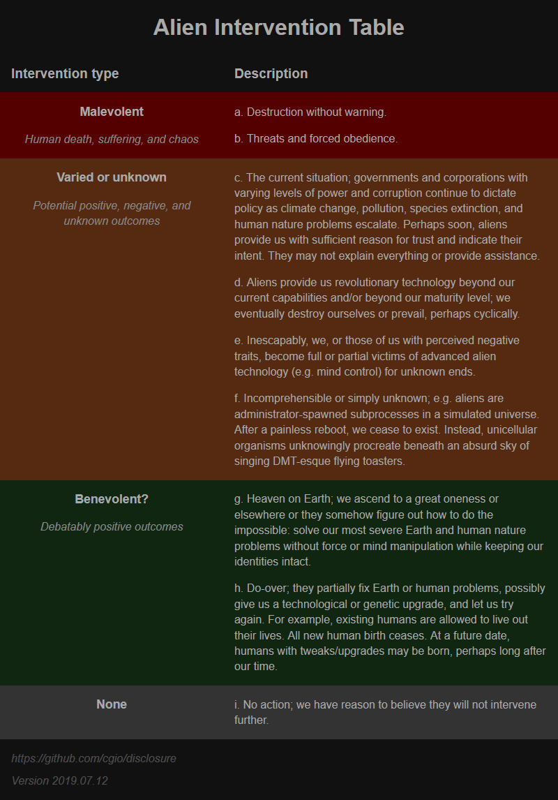

# Disclosure

This project's purpose is to assist disclosure and evolution.

---

## Notice

Before considering negative action, consider if such action is consistent with your better nature. I have never worked for the United States government as a contractor or otherwise. As a dual American-Canadian citizen, I would likely not be privy to classified information. All information herein was derived from public sources. Speculation is lawful. It is possible the TTSA and DoD actually encourages public speculation as related to this project. GitHub is a logical choice to have such an important conversation, as the platform promotes transparency and critical input. Also, opposition should not seek to subvert a technological cornerstone. Therefore, this may be an evolving project as disclosure unfolds.

Do not share classified information. All information is to be considered speculation unless evidenced from unclassified, public sources.

Attribution is kindly requested in order to promote contributor safety and project growth.

For simplicity, I use the terms "alien" or "ET" to describe non-human advanced intelligence.

---

## On a non-fiction TV show, a former US counter-intelligence officer visited a foreign government, procured a method to communicate with aliens, and upon his return home, provided the alien communication secrets to active US military officers?

Unidentified, a History network television program, aired its final seasonal episode (S01E06) July 5, 2019. The show focused on UAP (Unidentified Aerial Phenomena aka UFOs) encountered by former and current military personnel. Episodes are available via history.com and amazon.com.

A typical response to this is, "It's just a TV show!" On this point, please do your research and come back. Television and other forms of media have long been used to condition the public, and TTSA (To The Stars Academy of Arts & Science) has readily admitted this much. Below, you will see why the TTSA is a DoD (U.S. Department of Defense) program.

The final episode shows Tom DeLonge and Luis Elizondo of TTSA meeting with Italian government officials who claim possession of over 13,000 UAP case reports from a 70-year period. Elizondo is said to maintain an active security clearance and claims to be the former head of AATIP, the US government's Advanced Aerospace Threat Identification Program that studied UAP.

At approximately nine minutes, 10 seconds into the episode (excluding commercials), an Italian government official emphatically says:

> "We discovered we could see them [UAP] on a certain band of frequencies. Then we discovered that when they use their energy weapons, they must go outside the stealth mode. Only in that moment, can we hit them with depleted uranium weapons.”

Notably, the same official goes on to say: 

> "You could use the same frequency to provide a radio beacon to call them, to attract them, to show them that we have understood their technology."

In response, Tom DeLonge, founder of TTSA says:

> "Communication."

The official indicates support of Tom's idea. 

Immediately after, Elizondo's narrates:

> "This was next-level. One of our international friends may have even figured out a way to communicate."

The Italian meeting wraps with the show's narrator stating:

> "As the meeting winds down, Elizondo, DeLonge, and the Italian officials agree to form a global partnership. If their governments won't take the threat seriously, they'll work together, outside the system."

Later in the episode at approximately 29 minutes, 30 seconds, Elizondo and DeLonge allegedly meet with three active US military intelligence officers. The meeting is shown. The officers are blurred. During the meeting, Elizondo shares information obtained from the Italian government. Elizondo states the US government continues to actively run the "effort" (presumably a form of AATIP) with "official blessing." Clearly, the message is that the US government continues to study UAP.

For background, in multiple instances in Unidentified and national news, Elizondo and others (i.e. Christopher Mellon, former United States Deputy Assistant Secretary of Defense for Intelligence) have categorically stated the US military cannot protect us against UAP-level technology. The highly credentialed TTSA team would know this, and if they are affiliated with the DoD (as it appears), immediate surrender is an interesting notion to publicly repeat, even if logic agrees. Regarding the TTSA/DoD sanctioned effort theory, If Mellon, Elizondo, et al. were truly a defiant group releasing sensitive information without DoD approval (inclusive of "we won't stop you" plausible deniability), at minimum, their security clearances would be revoked.

The TTSA/DoD endeavors conflict; perhaps by design. Such conflict creates suspicion and is ultimately dangerous. If the TTSA and/or DoD are trying to "come clean" regarding UAP as suggested by TTSA, conflicting messages should be avoided. Otherwise, it all looks like a psyop that fuels conspiracy, which directly contradicts TTSA's mission and credibility, thus fueling the conspiracy fire further. If the intentions of the TTSA/DoD are truly earnest, the message to the public must be unified, clear, and eventually provide supportive reasonable explanations as to why UAP has been such a gnarled issue all these years; unless of course TTSA/DoD know something very grave and they find no reason to behave responsibly because "the end is near," which, had disclosure been handled responsibly thus far, should not even be a plausible thought.

Based on Unidentified S01E06, no exaggeration is required to state the US government is now in possession of, or posturing, a theoretical method to communicate with an advanced alien intelligence that is described as threatening. Since the technology involves a "radio beacon," and the US government has developed radio beacons, perhaps the government will soon succeed with alien communication.

Lastly, an intelligence capable of constructing the inconceivably advanced "Tic Tac" craft observed in the 2004 USS Nimitz encounter could probably figure out how to communicate with us by imparting recognizable pictures in clouds or crop fields. If they wanted to communicate with everyone, reason suggests they could have done so. More on that later.

Do you see a huge problem? As described next, we become more vulnerable, we do not know what to believe, and trust erodes.

---

## The problem: alien communication, possible or not, opens Pandora's box and allows the government to say and do practically anything.

**Considering the recent disclosure pace, what would stop the government from soon claiming aliens communicated important information?** How could we, the people, verify such communication if the technology is secret? Is there going to be an open-source effort? Probably not, because the government would likely not want people talking with aliens for multiple reasons (some truly benign). Therefore, we the people will likely always be in a position to trust the government to speak for aliens.

How dangerous and sustainable is that? Can you imagine a situation in which the US claiming it has communicated with aliens would not directly or indirectly endanger mankind? People already have reason to distrust the government. The phrase "absolute power corrupts absolutely" comes to mind. We are now dealing with a situation of absolute power. What will stop abuses of such power? What will stop an adversarial country from sending a missile our way to test if the US is acting on behalf of aliens or protected by alien technology? The US better not bluff.

We have been compromised. TTSA and the government need to swiftly "come correct." Pandora's box is open. Lack of critical thinking, cognitive dissonance, distraction, and alternative media focus will only slow public awareness for so long. Humans have a propensity for contagious fear.

## Main point: It does not matter if you believe in or are skeptical of UAP, aliens, or the government's ability to communicate with them. The fact is, the government will soon be in a position to say, "Advanced intelligence told us X, and they could harm us, so we must do Y."

The US government has acquired or forged the gift of prophecy – unprecedented carte blanche via an alien pen that could well dictate our future. Do you believe everyone in the government, present and future, will just leave that pen in the drawer? Do you think US adversaries will not make similar claims?

Hypothetical vulnerability examples:

> "Aliens saved us from [catastrophic solar activity] on [July 2, 2019]. We can trust them."

> "In exchange for alien technology that will save the world, we must do [X]."

> "They have been here for thousands of years. They have more right to this planet than we do."

> "We would still be monkeys if it wasn't for them."

> "Life would have been very different on this planet if it wasn't for them."

> "We have alien approval to [attack]."

> "The [Chinese] (but really aliens) attacked innocent [Americans]."

> "According to alien analysis, we can [ignore] [global warming] for [another 50 years]. For now, we will [continue course]."

> "Aliens support [politician] in [office]."

> "Aliens [interfered] with [Isreal's] [election process]."

> "Aliens have determined the [Constitution] to be unsustainable. They propose the following changes..."

> "The aliens have determined we must do [X] to avert crisis."

> "People of [country]: after decades of research, our great scientists and engineers have learned to communicate with alien intelligence. [America's] claims are simply false. Bear witness to the truth. Unite! Our moment of glory is upon us!"

**Use your imagination. Real or otherwise, the US government will essentially be whispering to gods, or claim to be, which may be worse. The situation allows for perfect proxy warfare.** How do we know aliens will not show up and set the record straight via force? As it stands, UAP buzz naval fleets in an intimidating fashion and have interfered with missile systems. They are playing with fire.

---

## Food for thought

* Disclosure does not appear to be an elaborate fiasco to drum up support for a space force. For example, Unidentified would have been a perfect opportunity to embolden such a plan. Also, TTSA and unaffiliated experts agree that we are too far behind to defeat them. And recently, when asked about aliens, Trump has ignored opportunities to promote a space force and defense spending.
* For a false flag alien invasion, human-made advanced aircraft could be costumed with alien-looking lights and structural additions. This is a current threat and may have occurred already.
* Why would the Italian government wait and share extremely valuable information only during a TV show? It would behoove mankind for the Italians to share this information long ago with the DoD if that was the actual intent. Is that not suspicious?
* How did TTSA coordinate contact with active military for Unidentified interviews? Did the DoD help?
* Considering the sensitive subject matter of Unidentified, did the DoD review each episode prior to air?
* Investigators may seek DeLonge's security clearance via a FOIA request to the Office of Personnel Management (OPM). After all, he sat alongside three blurred military intelligence officials for a highly sensitive briefing regarding UAP and shared information received from a foreign government. I am not aware of any indication or disclaimer that Unidentified is a dramatization. If DeLonge has no clearance or the FOIA request is fruitless, is that not concerning?
* Has DeLonge been afforded a security detail to prevent adversaries from learning alleged alien communication secrets?
* Are the aliens bending or reflecting light? A straight beam shot from undersea should only hit coastal homes unless the homes are elevated progressively inland.
* In other episodes of Unidentified, the TTSA offices in California are shown. Is it a convincingly decorated studio? If not, is there a SCIF (Sensitive Compartmented Information Facility) room on-site? I cannot imagine Elizondo and others would discuss classified UAP information from the offices, as pictured in the show. Someone may say something highly classified. There is even a public gift shop on-site, according to DeLonge at 19:30 in this video: https://youtu.be/5s0mnaz5uwI?t=1170. Perhaps TTSA would not mind producing documentation showing that a secure room exists on-site or local municipal building officials have such information? Why regularly depict a lack of OPSEC? Perhaps TTSA and Unidentified are DoD fronts for spreading distorted, self-serving disclosure? Are there no security concerns because the government has already established some form of an agreement with aliens?
* Really, the Italians figured out how to communicate with ET before we did? The National Reconnaissance Office and NSA could not detect and recognize unusual patterns? Have some SAPs (Special Access Programs) gone rogue?
* Elizondo's laptop could well contain classified information. Did Elizondo submit the thumb drive for security inspection prior to inserting it into his laptop? He appeared to still be in Italy when browsing the Italian UAP documents.
* Considering the questionable disclosure choices made thus far (and this document is by no means a comprehensive list), how can you be assured everything will be handled optimally?
* Things do not seem to add up. Considering the pace of disclosure-like over the last year or so (New York Times article, questionably released DoD UAP videos, revised US Navy UAP reporting guidelines, congressional UAP briefings, President Trump interview questions, etc.) something appears to be happening. Undeniably, Earth is in bad shape, so advanced intervention may be required. However, this is all such an odd way to go about disclosure.

---

## Are we equipped to play 500D alien chess?

We could be unwitting participants in a game of 500D chess with incomprehensibly advanced intelligence. An inherent trust paradox exists. Conceivably, an advanced intelligence would know we cannot trust them because they are unfamiliar. Therefore, to a degree, aliens who want to communicate should provide trust indicators (but not necessarily non-harm indicators). We are only capable of responding to stimuli that we understand. They should know this. We should look at the big picture to deduce threat and possible outcomes. Refer to my Alien Intervention Table below.

Effective disclosure must eventually account for the disturbing. There are reports of abduction, implantation, human and animal mutilation, hybrid breeding programs, nonconsensual mind reading and writing, and violent coverup. For example, the 1977 Colares UAP events allegedly involved beams of light (similar to those reported by the Italian government in Unidentified) terrorizing and killing and innocent Brazilians. Two decades later, the military captain in charge at the time (in 1977) "seemingly hung himself using the belt of his bathrobe" shortly after giving an interview to investigators. Problems compound when disturbing events, true or not, are ignored. 

And of course, we would likely want an explanation for our long history of suffering despite their awareness and advanced technology. 

*How many scenarios above are you comfortable with?*

---

## Aliens have communicated already.

If alien communication is now a thing, we should also look for signs of past communication. Remember crop circles? They are largely dismissed and ridiculed. Perhaps they now deserve a closer look.

For a moment, consider that crop fields are actually a wise communication medium.

Crop circles:

* Are a form of testable visual communication. Pictures are great for distribution and analysis. Communication through our other senses would be temporary, more subjective, startling, confusing, or hold little useful information. 
* Are accessible. In comparison, alien radio signals would be received by a select few and could be more readily suppressed or manipulated.
* Appear most often in crop fields. Crop fields exist throughout the world. They maintain structure over time. We can look for hoaxes. Desert sand, clouds, etc. are more ephemeral. 
* Provide significant logistical difficulty to suppress. Crop circles exist in wide open fields. Local reporters, farmers, bystanders, etc. can easily proliferate pictures.
* Are a relatively recent occurrence as of ~1978: https://allthatsinteresting.com/crop-circles. 

An authentic crop circle is one beyond reasonable human capability with due research. Read this analysis: http://www.cropcircleconnector.com/2017/cherhill/comments.html. Into hard science/physics? Read further about Sw J1644+57 here: https://en.wikipedia.org/wiki/GRB_110328A. What are the odds? What about the timeframe? Next, watch this video: https://www.youtube.com/watch?v=CGO5aNx2hos. Is he deceiving you?

### Why hasn't the government tried creating "outbound" crop circles with live streaming video for the world to watch?

I can think of only two realistic options:

1. Somehow, over the years, the DoD's best minds never thought of it?

2. Because the government wants to remain in control of their (objectively flawed) narrative. Tending the fields would be less work than building a custom radio beacon, as is the current suspicious TTSA/DoD narrative/path.

3. Elon Musk has not suggested it.

Seriously, upon request, I will gladly design a clever crop circle encoded with, "Help! What should we do?" Another option: "Help! What is the best question to ask?" All the government needs to do is print out a few copies, pay a farmer a few grand, head out to the fields with ropes and boards, stamp and sway, roll the live-streaming cameras, and wait. Though, this will likely not occur due to (2).

Next, to further complicate things, because of the many designs and interpretations, we should consider whether crop circles are the work of multiple alien types.

Read the analysis of this intricate pattern: http://www.cropcircleconnector.com/anasazi/fringe2014m.html. The decoded message is:

> "Beware the bearers of FALSE gifts & their BROKEN PROMISES. Much PAIN but still time. BELIEVE. There is GOOD out there. We OPpose DECEPTION. Conduit CLOSING."

This crop circle, though masterfully done, contains two glaring issues:

1. Humans are left to infer if the aliens are talking about governments, other aliens, or both. 
2. Some analysts believe this crop circle is a sort of alien wanted poster for evil Orion aliens, as per the three stars or UAP above the alien's shoulder. 

Seemingly beyond human construction, yet such a vague warning for humanity. For all we know, crop circles could be alien propaganda or false historical trust building tools. Regarding the whole ancient alien thing: any alien that encourages worship is not an alien I would trust.

Aliens: come out with it, or it looks like you are toying with the public even more than the government. Or are you in cahoots?

Again, the 500D chess scenario prevails.

## Conspiracies and conclusions

The trust paradox continues. We may never truly know if there are any "good guys." The Alien Intervention Table is mostly grim. Full disclosure is our best shot at discerning the good from the bad. As time goes on and disclosure probably continues, aliens and their technology will be ever more at the forefront of public awareness. The risk for hysteria increases, unless of course the government has reason not to care about panic: maybe we are all going to be dead soon, anyway. Maybe they have good news, but want to hold back on the good news because they want to run a psyop first. I do not like the prospects considering the frequency of alien abductions and mutilation reports.

Approximately 3.7 million Americans claim to have experienced alien abduction. See https://www.psychologytoday.com/us/blog/sleepless-in-america/201709/alien-abduction-part-ii. Many people have little or no interest in science fiction or do not see "grey alien" imagery on a regular basis. Why are so many reporting the archetypal grey alien frequently? Are alien dreams or alien visions during sleep paralysis really that common? Are hundreds of thousands of people getting rich from abduction stories? Is there a reason why the government has not looked into this phenomena? One would think that such mass hallucinations, or at least the suggestion of millions taken against their will by an unknown force, would warrant a government investigation. Can any person be abducted because of insufficient defenses? Are space thugs allowed to operate here? Is there any truth to some of the Majestic 12 documents? See http://majesticdocuments.com/documents/pre1948.php. Are the conspiracists are correct in that we cannot do anything about the space thugs due to an "unholy alliance?" Maybe the disclosure narrative prefers to skip over not just skeletons in the closet, but mass graves, as these unfilled, white rabbit holes may well descend into places darker than most can handle. Hypothetically, malevolent aliens would occasionally play nice to continue evil deeds. Abusive relationships tend to work out that way.

Because disclosure is a very important current event, and the government knows more than they tell, we should be on the lookout for parallels with other current events. The Epstein/pedogate thing is big news. If the public begins to believe the world elite are/were engaged in evil rituals, considering these people were very important decision makers, maybe they had reasons to take calculated risks in the depths of a known pedophile's tropical island? If I was an evil alien interested in subverting populations, I may be inclined to add my own "special effects" beyond a billionaire's cavernous special effects budget. I could convince the world's elite of just about anything!

Hell, if I like chess games, I may even play both sides. Indeed, the Q movement is a mysterious and powerful influence. 

What did Q post (#918) on March 10, 2018 at 2:05:58 PM EST?

> You are learning.
> How many coincidences before it becomes mathematically impossible?
> Wait until you learn who has been talking to you here.
> Q

Where was Q before the NSA's mass surveillance program? Allowing kids to get raped before deciding to act? Surely, Q would nipped this pedogate thing in the bud or prevented him from getting away with it the first time. Maybe allowing countless instances of child rape (and who knows what else) for years was all part of Q's plan. If Q is a source for global good, why does Q not denounce American exceptionalism or associations with Trump, who has and will make mistakes?

Here is the tie-in. As crazy at it sounds, Q or an official government source could say, "Q = aliens." Q is already associated with alien intervention (check Twitter hashtags). The people will not know what to believe. How convenient for aliens and the corrupt! Then any time our rights are subverted, we have no recourse. This is perfectly consistent with the above hypothetical vulnerability examples. We will never know what to believe! 

In any case, reliable information is imperative for individual survival. The public continues to be fed baloney. We are accustomed to binary, good-cop, bad-cop thinking, when life often has many layers. If you are going to drip information to prevent hysteria, each drip must be true. Everything needs to add up; past, present, and future. Otherwise, it all looks like one big psyop or suspiciously careless management of what portends to be the most significant event in human history. If you have been working with aliens but are being fucked with, come out and say so. The Earth is in bad shape. Our financial systems may well be on the brink of collapse. A "mass novelty event," sooner than later, based on the full truth, may be our best play.

My fellow Americans, join me in ignorance: behold the heavens (or hells – to be determined) through our great nation's lens of plausible deniability, history of deception, and preservation of special interests. While the government appreciates your tax dollars, they also believe you are too stupid to see, or at least question, the bullshit disclosure narrative.

---

Chad Gosselin

https://github.com/cgio/disclosure
